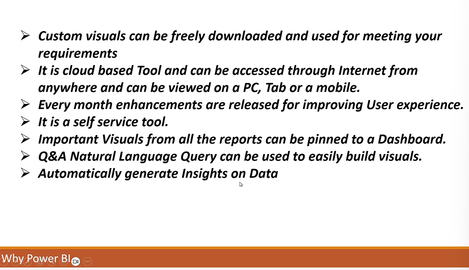

## Wednesday(007/08/2024)

## PowerBI : Business Intelligence

- 
- 
- 
- 
- Desktop Application
- Collect data from different sources and applies data visualization tools and transforms data into a visual format
- 

## Visualiztion tool

- 

### Why PowerBI

- 
- 
- Q & A generates the charts and bargraphs by givig questions in PowerBI

##

- Power BI desktop
- Power BI Pro : having more acceses and tools
- Power BI Premium : Gives more space
- PowerBI Mobile
- PowerBI Embedded : integrate with other powerbi or software
- PowerBI Report Server : Publishing our reports in own server, provides security
- Viwes Available in PowerbI ;
- 1. Report View
- 2. table view
- 3. model view
- Steps :
- 1. Collection of data[ from excel, db, text etc..]
- 2. Transform Data : Power Query
- 3. Data Modelling[Cretaing relationship between dofferent sources] Power Pivot in Excel
- 4. Visualization
- 5. Publish
- M[Mashup] language power query uses

## LookUp table

- Small in Size
- One column with all uniquw values
- No Duplicates in that column
- Each Unique values is called as pRimary key
- usally MEant for Description of data

## Transaction table

- Big in Size
- No column with unique vales(usally)
- There will be a column which are similar to primary key
- Duplicates will be ther
- Usally meant for calculations
- Task
  
